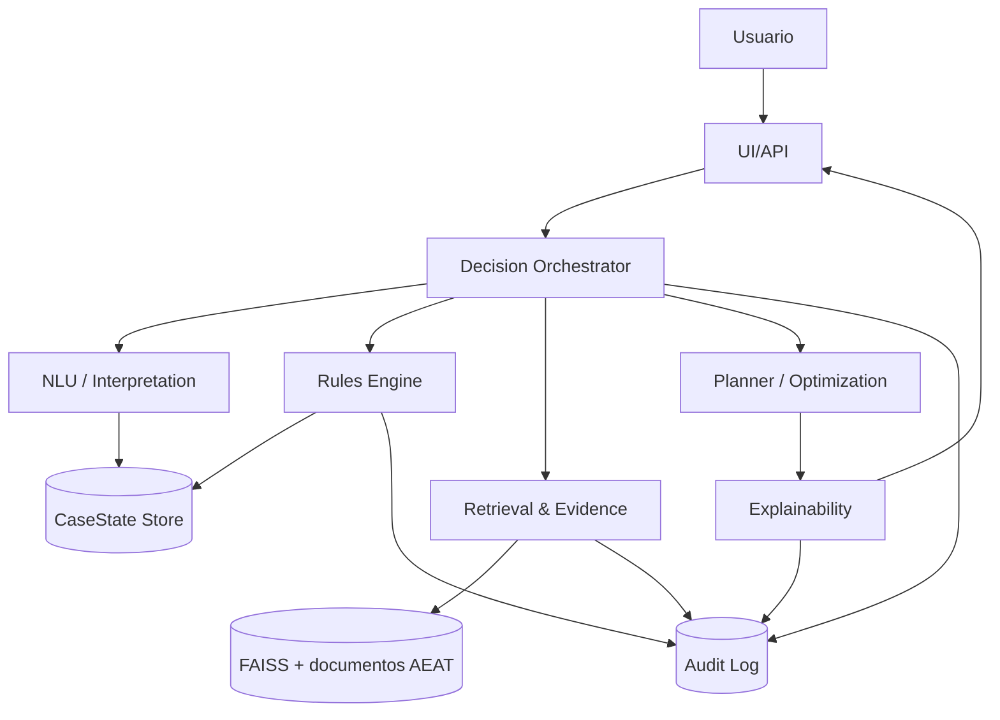

# ADR 0001: Arquitectura objetivo para Asesor Fiscal Inteligente de Decisión

- **Estado**: Aprobado (fase de fundaciones)
- **Fecha**: 2026-05-19
- **Decisores**: Equipo de plataforma HaciendaGPT
- **Ámbito**: Evolución incremental de la arquitectura actual RAG conversacional

## 1) Contexto actual

Hoy el repositorio implementa una aplicación RAG enfocada en consultas sobre la AEAT con estos bloques principales:

- **UI Streamlit** con chat y memoria en sesión (`st.session_state`) sin estado fiscal estructurado por caso.
- **Cadena LLM + Retrieval (LangChain)** con:
  - reformulación contextual de pregunta,
  - recuperación FAISS,
  - expansión MultiQuery,
  - compresión por embeddings,
  - respuesta final con prompt de sistema.
- **Ingesta documental** HTML/PDF para construir índice FAISS local con metadatos enriquecidos (`document_type`, `section`, `last_updated`, etc.).
- **API/CLI** utilitarias para crawling, indexado y evaluación básica.

Esta base permite Q&A grounded, pero aún no implementa el comportamiento de **asistente de decisión fiscal** (extracción de hechos, incertidumbre explícita, planner de acciones, auditabilidad por caso).

## 2) Problemas detectados en la arquitectura vigente

1. **Sin `CaseState` persistente por usuario/caso**
   - Solo existe historial textual de chat en memoria de sesión.
   - No hay ciclo de vida de caso (apertura, actualización, cierre, auditoría).

2. **Acoplamiento entre conversación y razonamiento**
   - El flujo actual combina recuperación y respuesta en un único paso.
   - Falta separación explícita entre interpretación, reglas, planificación y explicación.

3. **Ausencia de contratos de dominio explícitos**
   - No existen esquemas canónicos versionados para hechos fiscales, obligaciones, evidencia y plan de acción.

4. **Trazabilidad limitada para decisiones críticas**
   - El sistema cita fuentes, pero no guarda una relación auditable entre:
     - hechos asumidos,
     - reglas aplicadas,
     - recomendaciones generadas,
     - nivel de confianza e incertidumbre.

5. **Riesgo de crecimiento no controlado del prompt**
   - Reglas de comportamiento y política están concentradas en prompt largo.
   - Sin capas intermedias, aumenta fragilidad ante cambios de producto.

6. **Observabilidad orientada a operación técnica, no a decisiones**
   - Faltan eventos de negocio para inspeccionar por qué se recomendó X y no Y.

## 3) Decisión: arquitectura objetivo por capas

Se adopta una arquitectura por capas con contratos de dominio versionados y migración incremental sobre la app actual.

### 3.1 Capas objetivo

1. **UI/API Layer**
   - Streamlit y/o API HTTP exponen interacción de usuario.
   - Responsabilidades:
     - captura de turnos,
     - render de respuesta,
     - visualización opcional de estado del caso (modo debug),
     - delegación a orquestador.

2. **Orquestación (Decision Orchestrator)**
   - Punto único de coordinación del pipeline por turno.
   - Secuencia: `interpretación -> reglas -> retrieval de evidencia -> planner -> explainability`.
   - Administra políticas de fallback y timeout.

3. **NLU / Interpretation**
   - Extrae intención, hechos, supuestos e incertidumbres del lenguaje natural.
   - Produce salida estructurada (`InterpretationResult`) validada por esquema.

4. **Rules Engine**
   - Evalúa reglas declarativas para generar `ObligationCandidate` con confianza/riesgo.
   - Debe separar claramente:
     - disparadores por hechos,
     - condiciones faltantes,
     - justificación normativa requerida.

5. **Retrieval & Evidence Layer**
   - Recupera fuentes normativas/procedimentales relevantes para cada obligación/acción.
   - Reusa FAISS y metadata actual como base inicial.
   - Emite `EvidenceRef` tipado y trazable.

6. **Planner / Optimization**
   - Prioriza acciones según plazo, riesgo, impacto y completitud de información.
   - Genera plan accionable secuenciado (`ActionPlan/DecisionOutput`).

7. **Explainability Layer**
   - Construye respuesta final para usuario y vista de auditoría:
     - qué hechos se usaron,
     - qué faltó,
     - qué reglas dispararon,
     - con qué evidencia,
     - con qué confianza.

8. **Storage Layer**
   - Persistencia de `CaseState` + `AuditEvent` (arranque en SQLite, evolución a Postgres).
   - Versionado de esquemas y trazabilidad temporal.

### 3.2 Diagrama textual (Mermaid)

## 4) Contratos de dominio (dirección)

Se establecen como primera prioridad de implementación:

- `CaseState`
- `Fact`
- `MissingFact`
- `ObligationCandidate`
- `EvidenceRef`
- `ActionItem`
- `DecisionOutput`

Todos los contratos deberán:

- usar esquemas tipados (Pydantic),
- incluir `schema_version`, timestamps y campos de confianza,
- soportar serialización estable para persistencia y auditoría,
- mantener compatibilidad backward cuando sea posible.

## 5) Trade-offs

1. **Más capas vs. mayor complejidad operativa**
   - Beneficio: separa responsabilidades y mejora mantenibilidad.
   - Coste: más componentes y contratos que coordinar.

2. **Salida estructurada estricta vs. flexibilidad del modelo**
   - Beneficio: auditabilidad y validación robusta.
   - Coste: posible caída inicial de recall en extracción libre.

3. **Persistencia temprana en SQLite vs. salto directo a Postgres**
   - Beneficio: entrega rápida local y en CI.
   - Coste: límites de concurrencia/operación en producción.

4. **Planner determinista inicial vs. optimización avanzada**
   - Beneficio: comportamiento reproducible.
   - Coste: menor sofisticación en escenarios complejos.

## 6) Riesgos y mitigaciones

1. **Riesgo de “alucinación normativa”**
   - Mitigación: no emitir recomendación crítica sin `EvidenceRef`; marcar incertidumbre explícita cuando falte evidencia.

2. **Riesgo de ruptura funcional del chat actual**
   - Mitigación: integración por feature flags y fallback al flujo RAG actual.

3. **Riesgo de deuda de esquemas**
   - Mitigación: versionado semántico de contratos y tests de compatibilidad.

4. **Riesgo de latencia por pipeline multi-etapa**
   - Mitigación: presupuestos de latencia por etapa, caching y degradación controlada.

5. **Riesgo de baja trazabilidad en transición**
   - Mitigación: registrar eventos de auditoría desde la primera iteración de `CaseState`.

## 7) Plan incremental de migración (sin detener funcionalidad actual)

### Fase A — Fundaciones (no disruptiva)
- Añadir ADR y contratos de dominio iniciales.
- Añadir módulo `decision/` sin tocar ruta principal de respuesta.

### Fase B — Estado del caso
- Introducir `CaseState` + store SQLite.
- Persistir cada turno en paralelo al historial existente de Streamlit.
- Mantener respuesta actual del chat como output principal.

### Fase C — Interpretación estructurada
- Agregar `interpreter` para intención/hechos/incertidumbre.
- Mostrar resultados en modo debug, sin alterar todavía la respuesta final.

### Fase D — Reglas + evidencia
- Evaluar obligaciones candidatas y enlazar evidencia recuperada.
- Activar bloqueo de recomendaciones críticas sin grounding suficiente.

### Fase E — Planner + Explainability
- Generar plan accionable priorizado con riesgos/plazos.
- Exponer vista de trazabilidad para usuario técnico y auditoría.

### Fase F — Endurecimiento productivo
- Métricas de calidad (extracción, obligaciones, grounding).
- Hardening seguridad, observabilidad y runbooks.

## 8) Impacto en compatibilidad

- **Compatibilidad actual**: preservada en fases A-C (flujo RAG actual sigue operativo).
- **Posibles cambios futuros**:
  - ampliación de payloads API/UI con estado estructurado,
  - nuevos campos de respuesta y auditoría.
- **Política de migración**:
  - cambios incompatibles deberán introducirse con versionado explícito de esquema,
  - estrategia de lectura de versiones previas durante al menos una versión menor.

## 9) Estado de evidencia fiscal

Este ADR define arquitectura, **no** interpreta normativa fiscal concreta.
Si en implementación futura falta evidencia normativa verificable para una recomendación, el sistema debe devolver incertidumbre explícita y preguntas de clarificación, evitando afirmaciones categóricas no fundamentadas.
